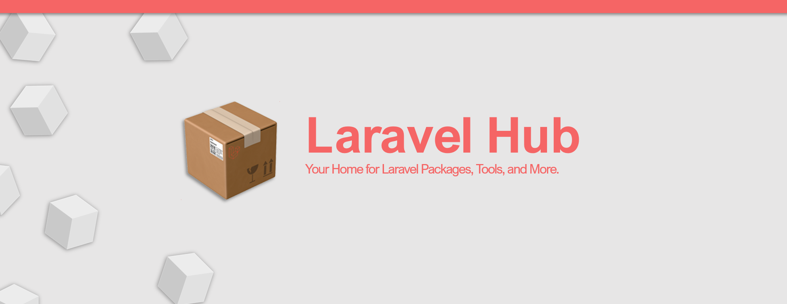

# Laravel Hub

Laravel hub is your home for laravel packages, template, tools and more.

# Installing Locally

#### Clone the repo

```bash
git clone https://github.com/WyattCast44/palette-hub.git hub
```

#### Move into project

```bash
cd hub
```

#### Copy the env file

Make sure you set your local credentials in your `.env` file.

```bash
cp .env.example .env
```

#### Install Composer dependencies

```bash
composer install
```

#### Install NPM dependencies (Optional)

```bash
npm install
```

#### Create OAuth App

- [Create GitHub OAuth App](https://github.com/settings/applications/new)
- URL:
    - `Authorization callback URL = http://hub.test/login/callback`
- Add the client ID and secret to `.env` file

```bash
GITHUB_CLIENT_ID=your-id
GITHUB_CLIENT_SECRET=your-secret
```

#### Migrate Database

```bash
php artisan migrate --seed
```

### Laravel Scout

This project uses Laravel Scout for searching various models, for local development it can be useful to use the `mysql` driver instead of the Algolia driver. To use this driver set the following `env` values:

```bash
SCOUT_DRIVER=mysql
SYNC_WITH_SEARCH=true
SCOUT_QUEUE=false
ALGOLIA_APP_ID=
ALGOLIA_SECRET=
```

If you wish to use Algolia, use the following setup, with your algolia keys: 

```bash
SCOUT_DRIVER=algolia
SYNC_WITH_SEARCH=true
SCOUT_QUEUE=true
ALGOLIA_APP_ID=your-app-id
ALGOLIA_SECRET=your-app-secret
```

# Deploy Script

```bash
$FORGE_PHP artisan migrate --force
$FORGE_PHP artisan scout:mysql-index
```